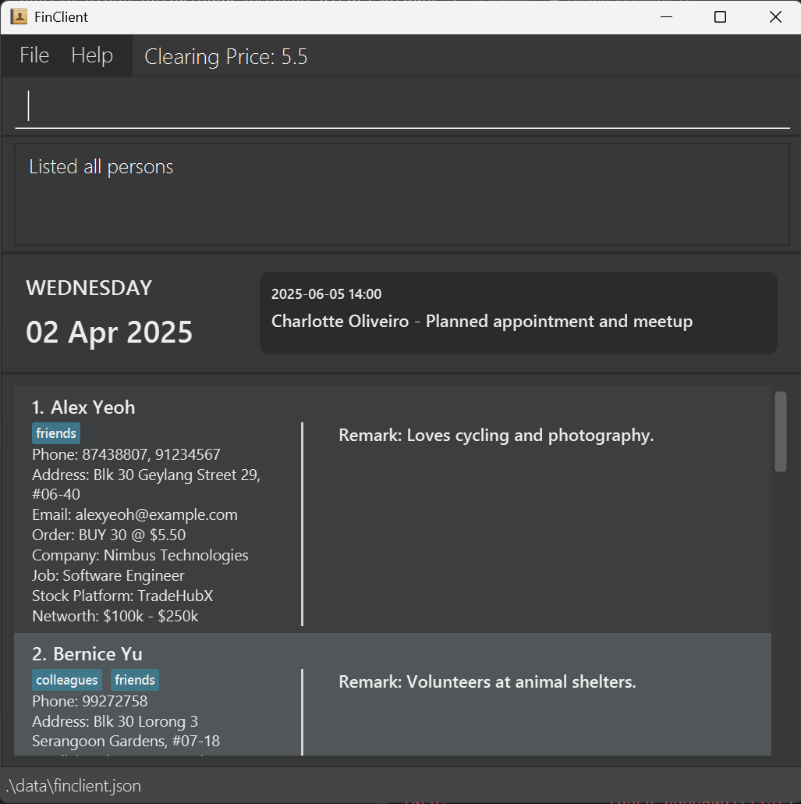

## Introduction

* This project is based on the AddressBook-Level3 project created by the [SE-EDU initiative](https://se-education.org).
* **_FinClient_** is a typing-based software meant for tech-savvy financial advisors to keep track of their clients. 
* The software will be mainly interacted with through the CLI (Command Line Interface), or simply put, via typing input commands with the keyboard.

## Example usages:
  * Adding and managing clients details
  * Adding notes to easily keep track of client's needs
## Value Proposition
  * Provide fast access to client details
  * Easy adding of new clients and required data
  * Allows adding of notes to client's contact to keep track of additional information.
  * Optimized for users who prefer **CLI** (Command Line Interface)

## Acknowledgment and Contribution
* This project is a **part of the se-education.org** initiative, built upon a project called AB3 (AddressBook-3).
* If you would like to contribute code to the project above, see [se-education.org](https://se-education.org/#contributing-to-se-edu) for more info.
* For the detailed documentation of the project mentioned above, see the **[Address Book Product Website](https://se-education.org/addressbook-level3)**.

