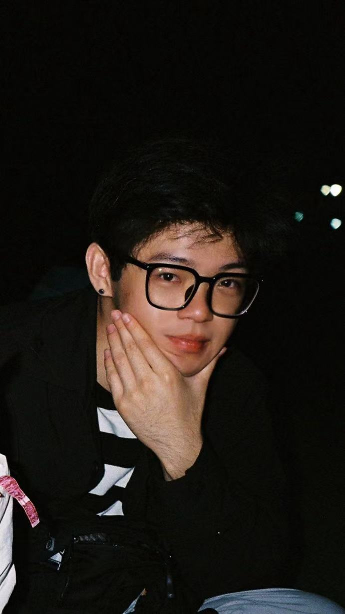
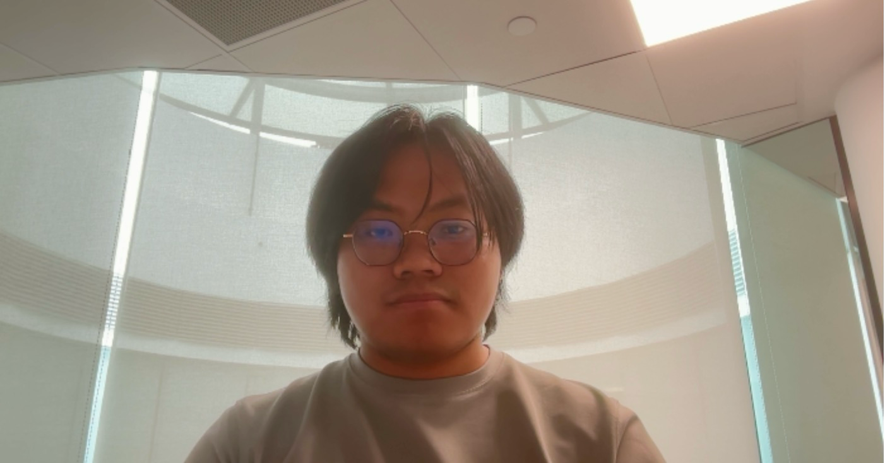
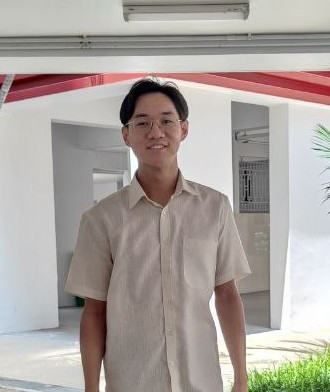

We are a team based in the [School of Computing, National University of Singapore](https://www.comp.nus.edu.sg).

You can reach us at the email `seer[at]comp.nus.edu.sg`

## Project team

### Huang Fengrui

[[github](https://github.com/RickyHFR)]
[[portfolio](team/rickyhfr)]

* Role: Project Advisor

### Sun Siliang

[[github](https://github.com/ki1r0)]
[[portfolio](team/ki1r0.md)]

* Role: Team Lead
* Responsibilities: UI

### Yizhan Han

[[github](https://github.com/hyizhak)] [[portfolio](team/hyizhak.md)]

* Role: Developer
* Responsibilities: Integration

### Lim Wei Song

[[github](https://github.com/wei-song1)]
[[portfolio](team/wei-song1.md)]

* Role: Documentation
* Responsibilities: Documentation

### Amos Tan

[[github](http://github.com/TanJieHaoAmos)]
[[portfolio](team/tanjiehaoamos.md)]

* Role: Coding Quality
* Responsibilities: Look after code quality, ensures adherence to coding standards, etc
