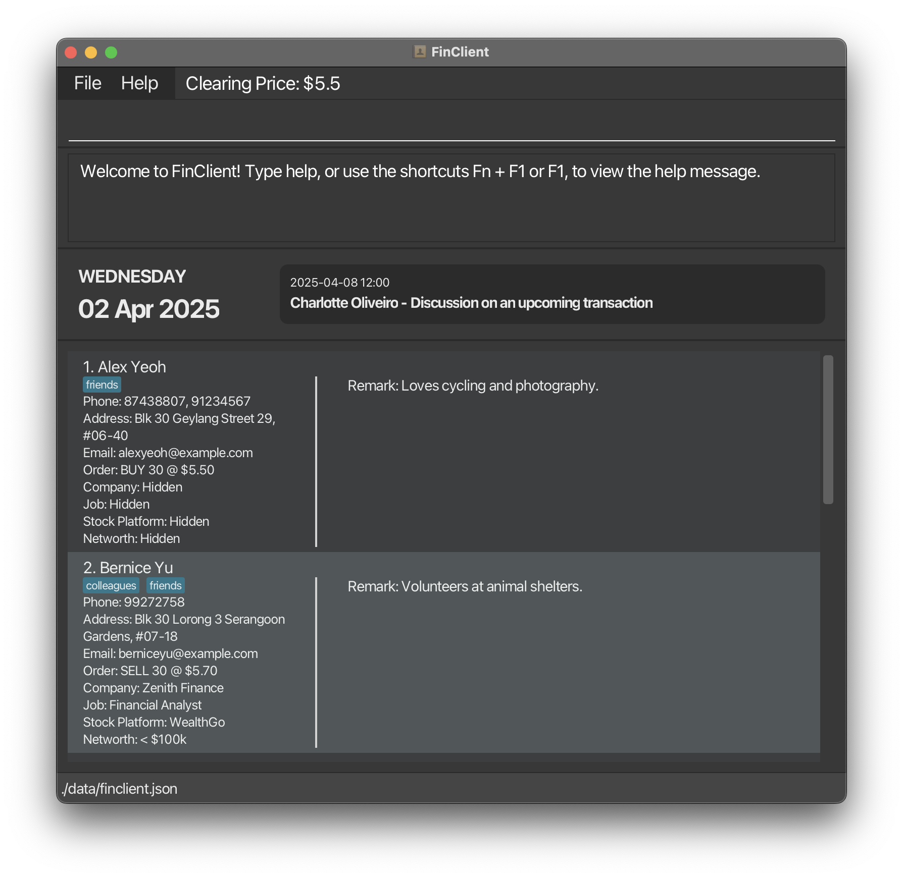
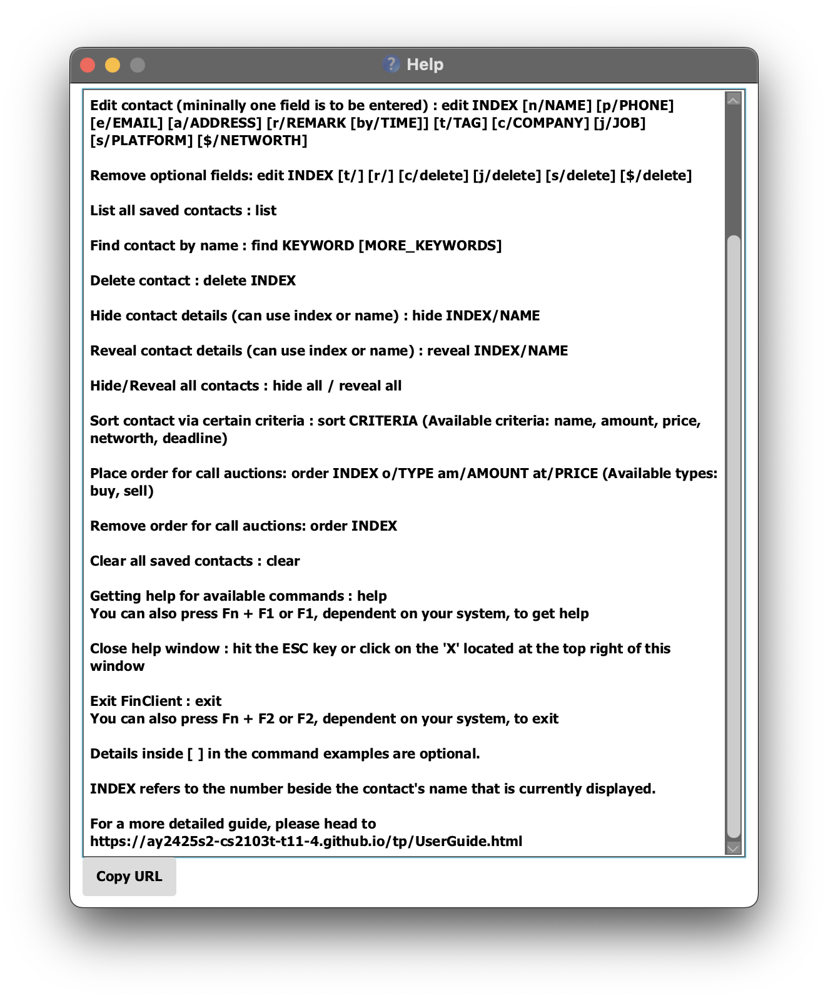
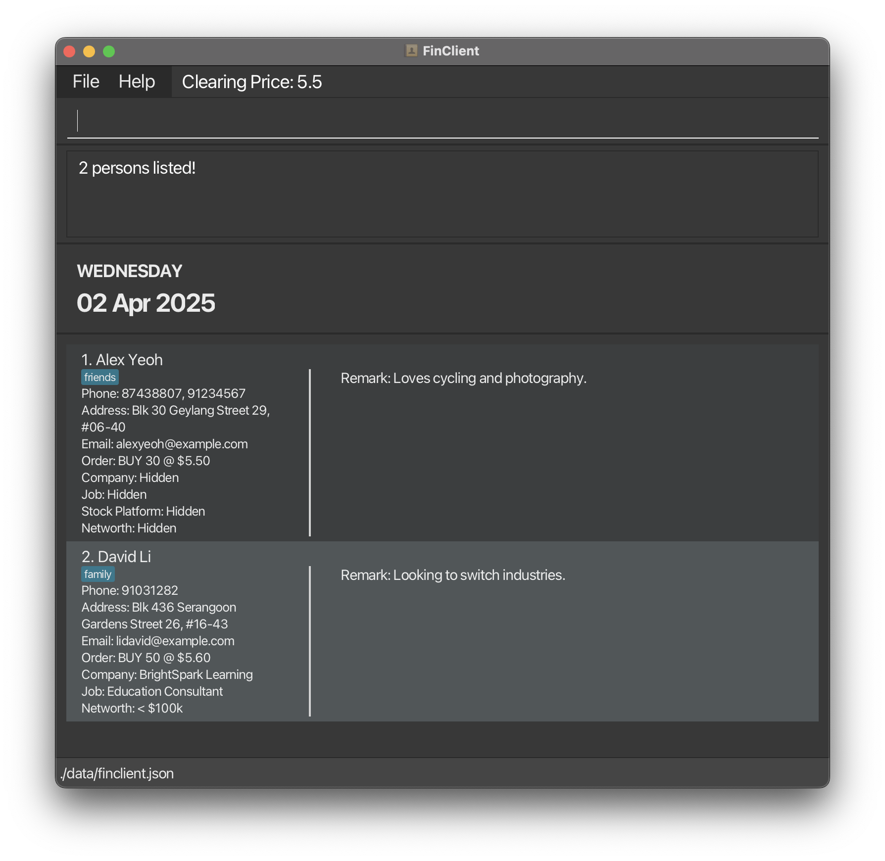

# FinClient User Guide

Welcome Financial Advisors! 👋 This guide will help you get started with FinClient.

Are you tired of juggling multiple client records and struggling to keep track of their preferences? FinClient is designed for tech-savvy financial advisors like you who prefer typing and need fast, efficient access to client details. 💡 With FinClient, managing hobbies, preferences, financial packages, and contact information has never been easier!

FinClient is a Command-Line Interface (CLI) application, or simply put, a typing-based application, that is built to help you manage your contacts and their financial details, while minimizing the time and effort spent on doing so! 🚀

Specific features include:

* 📇 Adding and deleting contacts
* ✏️ Editing your contacts' details
* 🔍 Locating your contacts by name
* 🏢 Maintaining contact-specific details such as jobs and their workplaces
* 📊 Sorting your contacts by name, networth, order prices and amounts
* 🕵️‍♂️ Hiding and revealing contacts
* 📈 Estimating Call Auction clearing prices simultaneously

You can look forward to an efficient and enjoyable experience with FinClient!

## Table of Contents
- [Quick start](#quick-start)
- [Features](#features)
  1. [Viewing help](#viewing-help-help)
  2. [Adding a person](#adding-a-person-add)
  3. [Listing all persons](#listing-all-persons-list)
  4. [Editing a person](#editing-a-person-edit)
  5. [Locating persons by name](#locating-persons-by-name-find)
  6. [Deleting a person](#deleting-a-person-delete)
  7. [Hiding a person](#hiding-a-person-hide)
  8. [Revealing a person](#revealing-a-person-reveal)
  9. [Limit orders and Call Auction calculator](#limit-orders-and-call-auction-calculator-order)
  10. [Sorting contacts](#sorting-contacts-sort)
  11. [Clearing all entries](#clearing-all-entries-clear)
  12. [Exiting the program](#exiting-the-program-exit)
  13. [Saving the data](#saving-the-data)
  14. [Editing the data file](#editing-the-data-file)
- [Known issues](#known-issues)
- [FAQ](#faq)
  1. [General Usage](#general-usage)
  2. [Commands and Features](#commands-and-features)
  3. [Data Management](#data-management)
  4. [Trouble Shooting](#trouble-shooting)
- [Command summary](#command-summary)

--------------------------------------------------------------------------------------------------------------------

## Quick start

> Note:
> - "Home folder" refers to the main folder where your FinClient files are stored.
> - "cd into" means opening your command terminal and typing "cd" followed by a space and the folder path (e.g., cd /Users/yourname/Documents). Then press Enter to change the current directory.
> - "GUI" (Graphical User Interface) is the windowed application that you interact with using your mouse and keyboard.

1. Ensure you have Java `17` or above installed in your Computer.<br>
   **Mac users:** Ensure you have the precise JDK version prescribed [here](https://se-education.org/guides/tutorials/javaInstallationMac.html).

2. Download the latest `.jar` file from [here](https://github.com/AY2425S2-CS2103T-T11-4/tp/releases).

3. Find the file (called `finclient.jar`) and move it into the folder where you want your FinClient app to store data.

4. Open a command window (also known as `Terminal` on MacOS or `Command Prompt` on Windows).
   1. On Windows: Press the Windows key, type cmd, and press Enter.
   2. On Mac: Open Terminal from the Applications > Utilities folder.

5. In the command window, go to the folder where you saved the file. You do this by typing cd followed by the folder path.

    For example:
   ```
   cd Downloads/FinClient
   ```

6. Now, start the app by typing this and pressing Enter:
   ```
   java -jar finclient.jar
   ```

   After a few seconds, a window should pop up that looks like the one below. It comes with some sample data already filled in, so you can start exploring right away.

<figure>
  
  <figcaption align="center"><strong>Figure 1:</strong> Main GUI of FinClient.</figcaption>
</figure>

7. Type the command in the command box (at the top of the window) and press Enter to execute it. e.g. typing **`help`** and pressing Enter will open the help window. Some example commands you can try (you can refer to the [Features](#features) section below for details of each command):

   * `list` : List all contacts.

   * `add n/John Doe p/98765432 e/johnd@example.com a/John street, block 123, #01-01` : Add a contact named `John Doe` to FinClient.

   * `delete 3` : Delete the 3rd contact shown in the current list.

   * `clear` : Delete all contacts.

   * `exit` : Exit the app.

Congratulations! You've successfully finished setting up FinClient 🎉. Explore the [Features](#features), check out the [FAQ](#faq), and review the [Known issues](#known-issues) for more information 🚀.

--------------------------------------------------------------------------------------------------------------------

## Features

<div markdown="block" class="alert alert-info">

**:information_source: Notes about the command format:**<br>

* Words in `UPPER_CASE` are the arguments to be supplied by the user.<br>
  e.g. in `add n/NAME`, `NAME` is an argument which can be used as `add n/John Doe`.

* Items that are in square brackets are optional, and those without square brackets are mandatory. <br>
  e.g. `n/NAME [t/TAG]` can be used as `n/John Doe t/friend` or as `n/John Doe`.

* Items followed by `…` can be repeated any number of times (including not at all).<br>
  e.g. `[t/TAG]…` can be used as ` `(i.e. 0 times), `t/friend`, or `t/friend t/family` etc.

* Arguments can be in any order <br>
  e.g. if the command specifies `n/NAME p/PHONE_NUMBER`, `p/PHONE_NUMBER n/NAME` is also acceptable.

* Extraneous arguments for commands that do not take in parameters (such as `help`, `list`, `exit` and `clear`) will be ignored.<br>
  e.g. if the command specifies `help 123`, it will be interpreted as `help`.

* The application accepts more than one spaces between the command and the arguments, and between the arguments themselves. However,
at least one space must be included to separate them.<br>
    e.g. `delete [multiple spaces] 1` is acceptable, but `delete1` is not.

* For all commands that expect index, the index provided must be a positive integer. FinClient treats input
  indices that are not positive integer (such as 0, -1, 10.5) as format error, and will only detect out of bound index
  given the index provided is a positive integer. <br>
  e.g. Given 10 contacts stored in FinClient, `delete 1` is acceptable, but `delete 0` and `delete 11` are not. Former displays
  an error message about command format, while latter displays an error message about index out of bound.
</div>

<div markdown="span" class="alert alert-warning">

:exclamation: **Caution:**
If you are referring to a PDF version of this document, be careful when copying and pasting commands that span multiple lines as space characters surrounding line-breaks may be omitted when copied over to the application.
</div>

### Viewing help : `help`

Shows a scrollable message containing current available commands and provides a description on how to get more help.

Format: `help`

<figure>
  
  <figcaption align="center"><strong>Figure 2:</strong> Help Message.</figcaption>
</figure>

### Adding a person : `add`

Adds a person to FinClient.

Format: `add n/NAME p/PHONE_NUMBER [p/PHONE_NUMBER]… e/EMAIL a/ADDRESS [r/REMARK [by/TIME]] [t/TAG]…​ [c/COMPANY] [j/job] [s/STOCKPLATFORM] [$/NETWORTH]`

<div markdown="span" class="alert alert-primary">

:bulb: **Tip:**
A person can have any number of tags (including 0)<br>
:bulb: **Tip:**
Optional fields can be left out when adding a person's contact. However, if you miss out any compulsory arguments, 
FinClient will display the correct format and not allow you to add the contact. <br>
:bulb: **Tip:**
If all compulsory fields are present, FinClient will prompt error message specific to each argument if there are any issues.<br>
</div>

<div markdown="span" class="alert alert-warning">

:exclamation: **Caution:**
Duplicate persons are not allowed. If you try to add a person with the same name, same email and same address as an existing person, FinClient will ignore the new entry and display a message indicating that the person already exists.<br>
</div>

Now, suppose you want to add the contact of Betsy Crowe, who is your friend. In that case, your command includes her name (`n/Betsy Crowe`), a tag indicating "friend" (`t/friend`), her email (`betsycrowe@example.com`), address (`Newgate Prison`), and phone number (`p/1234567`) along with optional remarks (`r/10 year sentence t/criminal`).

Example input:
* `add n/Betsy Crowe t/friend e/betsycrowe@example.com a/Newgate Prison p/1234567 r/10 year sentence t/criminal `

Now, suppose you want to add the contact of Sherlock Holmes, a family member. You include his name (`n/Sherlock Holmes`), a "family" tag, his email, phone number, and address. You also add a remark (`r/family dinner`) and schedule it with a timestamp using `by/2025-04-03 18:00`, indicating when the event will happen.

Example input:
* `add n/Sherlock Holmes t/family e/sherlock@example.com a/221B Baker Street p/1234567 r/family dinner by/2025-04-03 18:00 t/detective `

### Listing all persons : `list`

Shows a list of all persons in FinClient.

Format: `list`

<div markdown="span" class="alert alert-primary">

:bulb: **Tip:**
`list` is handy in these cases:
* **Resetting after a filtered view:** If you have just used the [`find`](#locating-persons-by-tag) command (or any other command) that shows a _subset_ of your contacts, `list` will bring back the _full set_ of all contacts.
* **Verifying updates:** After adding, editing, or removing multiple persons, running `list` ensures that any unexpected filters or sorting are cleared, so you see the entire, up-to-date list at once.
* **Navigating from another feature:** In some (proposed) workflows, you might be reviewing transaction records or other data. Using `list` ensures you return to the complete contact view without any lingering search results or partial views.
</div>


### Editing a person : `edit`

Edits an existing person in FinClient.

Format: `edit INDEX [n/NAME] [p/PHONE] [e/EMAIL] [a/ADDRESS] [r/REMARK [by/TIME]] [t/TAG]…​ [c/COMPANY] [j/job] [s/STOCKPLATFORM] [$/NETWORTH]`

* Edits the person at the specified `INDEX`. The index refers to the index number shown in the displayed person list. The index **must be a positive integer** 1, 2, 3, …​
* At least one of the optional fields must be provided.
* Existing values will be updated to the input values.
* When editing tags, the existing tags of the person will be removed i.e adding of tags is not cumulative.
* You can remove all the person’s tags by typing `t/` without specifying any tags after it.
* Similarly, you can remove the person's remark field by typing `r/` with no description or timestamp.
* However, empty remarks with timestamp such as `r/ by/2025-03-30 16:00` are not accepted.
* For the optional fields of company, job, stock platform and networth, you can remove the existing value by typing their prefix followed with `delete`.

Examples:
*  `edit 1 p/91234567 e/johndoe@example.com` Edits the phone number and email address of the 1st person to be `91234567` and `johndoe@example.com` respectively.
*  `edit 2 n/Betsy Crower t/` Edits the name of the 2nd person to be `Betsy Crower` and clears all existing tags.
*  `edit 1 r/scheduled meeting by/2025-04-03 10:00` Edits the remark of the 1st person to be `scheduled meeting` and associates it with the timestamp `2025-04-03 10:00`, indicating the scheduled time of the event.
*  `edit 1 r/` removes the remark field of the 1st person.
*  `edit 2 j/delete c/LittleStartUp s/delete $/delete` Edits the company of the 2nd person to be `LittleStartUp` and clears the existing job, stock platform and networth.

<div markdown="span" class="alert alert-primary">

:bulb: **Tip:**
Tag, Company, Job, Stock Platform and Networth are all optional. You can delete these optional fields too!
</div>
<div markdown="span" class="alert alert-warning">

<div markdown="span" class="alert alert-warning">

:exclamation: **Caution:**
Duplicate persons are not allowed. If you try to edit a person to the same name, same email and same address as an existing person, FinClient will ignore the new entry and display a message indicating that the person already exists.<br>
</div>

:exclamation: **Caution:**
To add deadlines to remarks, the by/ argument must be supplied right after r/.

The edit command requires `r/REMARKS by/TIME` if you wish to add a deadline. `by/TIME r/REMARKS` is not acceptable. Similarly, there should not any other arguments between these two.
</div>

### Locating persons by name : `find`

Finds persons whose names contain any of the given keywords.

Format: `find KEYWORD [MORE_KEYWORDS]`

* The search is case-insensitive. e.g `hans` will match `Hans`.
* The order of the keywords does not matter. e.g. `Hans Bo` will match `Bo Hans`.
* Only the name is searched.
* Only full words will be matched e.g. `Han` will not match `Hans`.
* Persons matching at least one keyword will be returned (i.e. `OR` search).
  e.g. `Hans Bo` will return `Hans Gruber`, `Bo Yang`.
* Use `list` to see all contacts again.

Examples:
* `find John` returns `john` and `John Doe`.
* `find alex david` returns `Alex Yeoh`, `David Li`.<br>

<figure>
  
  <figcaption align="center"><strong>Figure 3:</strong> Result of <code> find alex david</code>.</figcaption>
</figure>

### Deleting a person : `delete`

Deletes the specified person from FinClient.

Format: `delete INDEX`

* Deletes the person at the specified `INDEX`.
* The index refers to the index number shown in the displayed person list.
* The index **must be a positive integer** 1, 2, 3, …​

Examples:
* `list` followed by `delete 2` deletes the 2nd person in FinClient.
* `find Betsy` followed by `delete 1` deletes the 1st person in the results of the `find` command.

### Hiding a person : `hide`

Hides the details of the specified person in FinClient.

Format: `hide all|INDEX|name`

* Hides the details of the person specified at `INDEX` or by `name`.
* Hides all contacts' details if `all` is used.
* The index **must be a positive integer** 1, 2, 3, …​

Examples:
* `list` followed by `hide 2` hides the 2nd person in FinClient.
* `find Betsy` followed by `hide 1` hides the 1st person in the results of the `find` command.

<figure>
  
  <figcaption align="center"><strong>Figure 4:</strong> Example of a hidden person.</figcaption>
</figure>

### Revealing a person : `reveal`

Reveals the details of the specified person in FinClient.

Format: `reveal all|INDEX|name`

* Reveals the details of the person specified at `INDEX` or by `name`.
* Reveals all contacts' details if `all` is used.
* The index **must be a positive integer** 1, 2, 3, …​

Examples:
* `reveal 2` reveals the 2nd person in FinClient.
* `find Betsy` followed by `reveal 1` reveals the 1st person in the results of the `find` command.

### Limit orders and Call Auction calculator : `order`

Records a limit order for a specific contact in FinClient.

The [call auction](https://www.investopedia.com/terms/c/call-auction.asp) calculator uses the aggregated orders to determine a clearing price.

Format: `order INDEX [o/TYPE am/AMOUNT at/PRICE]`

* Records a limit order for the person specified at `INDEX`.
* The index **must be a positive number displayed beside a contact's name** 1, 2, 3, …​
* If only the index is provided, the order will be recorded as an empty order.
* The order type can be `BUY` or `SELL`.
* The amount must be a positive integer.
* The price must be a positive decimal number.

Examples:
* `order 1` records an empty order for the person listed at index 1.
* `order 1 o/buy am/10 at/9.50` records a buy order of 10 units at $9.50 for the person listed at index 1.
* `order 1 o/sell am/10 at/10.50` records a sell order of 10 units at $10.50 for the person listed at index 1.

<div markdown="span" class="alert alert-info">

:information_source: **Design choice:**
Since FinClient is designed for a single financial instrument, every order recorded relates to that same asset.
</div>

### Sorting contacts : `sort`

Sorts the contact list based on a set of certain criteria.

Format: `sort CRITERIA`

Examples:
* `sort name` sorts the contact list in FinClient based on contact's name.
* `sort networth` sorts the contact list in FinClient based on contact's networth.

Current available criteria are:
* `name` : Sorts the contact list based on contact's name.
* `networth` : Sorts the contact list based on contact's networth bracket.
* `amount` : Sorts the contact list based on contact's order amount.
* `price` : Sorts the contact list based on contact's order price (per unit).
* `deadline`: Sorts the contact list based on contact's deadline.

<div markdown="span" class="alert alert-primary">

:bulb: **Tip:**
For criteria related to clients' orders (price, amount), all BUY type orders are placed before SELL after sorting, with 
orders of same type sorted by the given criteria.
</div>

### Clearing all entries : `clear`

Clears all contact entries from FinClient.

Format: `clear`

<div markdown="span" class="alert alert-warning">

:exclamation: **Caution:**
This command clears all contacts and their details **permanently** which is irreversible! Currently, our application
does not support clear by categories such as `clear tag` or `clear remark`, and all such commands will be 
treated as `clear`.<br>
</div>

### Exiting the program : `exit`

Exits the program.

Format: `exit`

### Saving the data

FinClient data are saved in the hard disk automatically after any command that changes the data. There is no need to save manually.

### Editing the data file

FinClient data are saved automatically as a JSON file `[JAR file location]/data/finclient.json`. Advanced users are welcome to update data directly by editing that data file.

<div markdown="span" class="alert alert-warning">

:exclamation: **Caution:**
If your changes to the data file makes its format invalid, FinClient will discard all data and start with an empty data file at the next run. Hence, it is recommended to take a backup of the file before editing it.<br>
Furthermore, certain edits can cause FinClient to behave in unexpected ways (e.g., if a value entered is outside of the acceptable range). Therefore, edit the data file only if you are confident that you can update it correctly.
</div>

--------------------------------------------------------------------------------------------------------------------

## <span id="known-issues">Known issues</span>

1. **When using multiple screens**, if you move the application to a secondary screen, and later switch to using only the primary screen, the GUI will open off-screen. The remedy is to delete the `preferences.json` file created by the application before running the application again.
2. **If you minimize the Help Window** and then run the `help` command (or use the `Help` menu, or the keyboard shortcut `F1`) again, the original Help Window will remain minimized, and no new Help Window will appear. The remedy is to manually restore the minimized Help Window.
3. **If you use the shortcuts provided to access help or exit the application**, note that some devices differ in what to press for the shortcut. For example, to access help, you may need to press `Fn + F1` or just `F1` depending on your device settings. The remedy is to check which of the two, `Fn + F1` or `F1`, works for you to open help, and which of the two, `Fn + F2` of `F2` works for you to exit the application.

--------------------------------------------------------------------------------------------------------------------

## FAQ

<!-- FAQ: General Usage -->
### General Usage
<details>
  <summary>What is FinClient, and who is it for?</summary>
  <p><em>FinClient is a CLI-based contact management tool designed for financial advisors who prefer typing over using a GUI. It helps manage client records, preferences, financial details, and more.</em></p>
</details>
<details>
  <summary>Do I need an internet connection to use FinClient?</summary>
  <p><em>No, FinClient runs locally on your computer, so an internet connection is not required.</em></p>
</details>
<details>
  <summary>Can I use FinClient on both Windows and Mac?</summary>
  <p><em>Yes, FinClient works on both Windows and Mac, as long as you have Java 17 or above installed.</em></p>
</details>
<details>
  <summary>How do I update FinClient to the latest version?</summary>
  <p><em>Simply download the latest .jar file from the <a href="https://github.com/AY2425S2-CS2103T-T11-4/tp/releases">official source</a> and replace your existing one.</em></p>
</details>
<br>

<!-- FAQ: Commands & Features -->
### Commands and Features
<details>
  <summary>Can I undo an action in FinClient?</summary>
  <p><em>Currently, there is no undo command, so be careful when making changes. However, you can back up your data before making major edits.</em></p>
</details>
<details>
  <summary>How can I search for a client?</summary>
  <p><em>You can use:<br>
  <code>find NAME</code> to search by name<br></em></p>
</details>
<details>
  <summary>What is considered a duplicate contact?</summary>
  <p><em>A contact with the exact same name, email and address is considered a duplicate. Contacts can share the same names, or same email address, or same physical addresses, and it won't be considered a duplicate since people can have same names, share emails or live together. It is only considered a duplicate if they have all 3 exact same details.</em></p>
</details>
<details>
  <summary>What happens if I try to add a duplicate contact?</summary>
  <p><em>FinClient does not allow duplicate entries. If a contact with the same name, same email and same address already exists, FinClient will give a warning and not allow it. Note that for it to be considered a duplicate contact, they must have exactly the same name, email and address.</em></p>
</details>
<details>
  <summary>What happens if I try to edit a contact so that it's the same as an existing contact?</summary>
  <p><em>FinClient does not allow duplicate entries. If a contact with the same name, same email and same address already exists for the contact you are trying to edit, FinClient will give a warning and not allow it. Note that for it to be considered a duplicate contact, they must have exactly the same name, email and address.</em></p>
</details>
<details>
  <summary>How do I sort my contacts?</summary>
  <p><em>Use <code>sort</code> followed by the criteria, such as <code>sort name</code> or <code>sort networth</code>.</em></p>
</details>
<details>
  <summary>Can I hide certain contacts from my list?</summary>
  <p><em>Yes, you can use the <code>hide</code> command to hide contacts and <code>reveal</code> to show them again.</em></p>
</details>
<details>
  <summary>What is the Call Auction calculator?</summary>
  <p><em>This feature helps estimate clearing prices for limit orders. Refer to the "Limit orders and Call Auction calculator" section for details.</em></p>
</details>
<details> <summary>Why can I not include '+' symbol when dialing international numbers?</summary> <p><em><code>+</code> symbol is just a placeholder for your country's international dialing prefix.</em></p> <p>You can replace <code>+</code> with the appropriate digits for your region:</p>
In the <strong>US/Canada</strong>, use <code>011</code><br>
In the <strong>UK</strong>, use <code>00</code><br>
In <strong>Australia</strong>, use <code>0011</code><br>
<p>For example, instead of dialing <code>+44 20 7946 0958</code> (UK), you can dial <code>011 44 20 7946 0958</code> if you're in the US.</p> <p>This is why symbols are not allowed when you write phone numbers onto FinClient.</p> </details>
<br>

<!-- FAQ: Data Management -->
### Data Management
<details>
  <summary>Where is my data stored?</summary>
  <p><em>Your data is saved in a file in the same directory as finclient.jar.</em></p>
</details>
<details>
  <summary>Can I edit the data file manually?</summary>
  <p><em>Yes, but be cautious. The data is stored in a structured format, and incorrect modifications may corrupt it.</em></p>
</details>
<details>
  <summary>Is my data automatically saved?</summary>
  <p><em>Yes, any changes made in FinClient are automatically saved.</em></p>
</details>
<details>
  <summary>How do I clear all data and start fresh?</summary>
  <p><em>Use the <code>clear</code> command, but be aware that this action is irreversible.</em></p>
</details>
<details>
  <summary>Can I back up my data?</summary>
  <p><em>Yes, simply copy the data file to a safe location before making major changes.</em></p>
</details>
<br>

<!-- FAQ: Troubleshooting -->
### Trouble Shooting
<details>
  <summary>I get an error when trying to start FinClient. What should I do?</summary>
  <p><em>Ensure you have Java 17 or above installed.<br>
  Verify that you are running <code>java -jar finclient.jar</code> in the correct directory.<br>
  Check if the .jar file is corrupted by redownloading it.</em></p>
</details>
<details>
  <summary>Some commands are not working as expected. How can I fix this?</summary>
  <p><em>Double-check the command format and arguments using the <code>help</code> command.</em></p>
</details>
<details>
  <summary>I accidentally deleted a contact. Can I recover it?</summary>
  <p><em>If you have a backup of your data file, you can restore it. Otherwise, deleted contacts cannot be recovered.</em></p>
</details>
<details>
  <summary>How can I reset FinClient if something goes wrong?</summary>
  <p><em>Delete the data file and restart FinClient. This will reset it to a fresh state.</em></p>
</details>

--------------------------------------------------------------------------------------------------------------------

## <span id="command-summary">Command summary</span>

Action | Format | Example
---|--------|---
**Add** | `add n/NAME p/PHONE_NUMBER [p/PHONE_NUMBER]… e/EMAIL a/ADDRESS [r/REMARK [by/]] [t/TAG]…​ [c/COMPANY] [j/job] [s/STOCKPLATFORM] [$/NETWORTH]` | `add n/James Ho p/22224444 e/jamesho@example.com a/123, Clementi Rd, 1234665 t/friend t/colleague c/Engineer`
**Clear** | `clear` | `clear`
**Delete** | `delete INDEX` | `delete 3`
**Edit** | `edit INDEX [n/NAME] [p/PHONE_NUMBER] [e/EMAIL] [a/ADDRESS] [r/REMARK [by/]] [t/TAG]… [c/COMPANY] [j/job] [s/STOCKPLATFORM] [$/NETWORTH]` | `edit 2 n/James Lee e/jameslee@example.com`
**Find** | `find KEYWORD [MORE_KEYWORDS]` | `find James Jake`
**Hide** | `hide all` or `hide INDEX` or `hide name` | `hide 2`
**Reveal** | `reveal all` or `reveal INDEX` or `reveal name` | `reveal 2`
**Sort** | `sort CRITERIA` | `sort name`
**Order** | `order INDEX o/TYPE am/AMOUNT at/PRICE` | `order 1 o/buy am/5 at/5.50`
**List** | `list` | `list`
**Help** | `help` | `help`
